# EVALUATION — how turn-reduce gets judged

> **Status: parked research record, as of 2026-08-13.** P01 ran once and found harm;
> the full benchmark grid was not run. The incomplete prototype is retained only in
> branch `wip/turn-reduction-prototype` as a code backup; `main` does not support the `ON` arm.
> Method borrowed from `~/dev/concepts/deliberate-agent/docs/cross-domain-comparison.md`.

## The position in one paragraph

Turn-reduce is judged on whether it **raises what the agent can achieve**, not on how
much context it removes. Percent-reduced is not an endpoint and never appears in a
result. The primary measurement is **success rate as a function of session depth**,
paired OFF vs ON on identical tasks, never pooled — pooling averages the shallow half
(where both arms tie by construction) with the deep half (where the whole effect lives)
and reports approximately nothing. Cost is a **guardrail**, not a win condition: it is
allowed to rise, it is not allowed to blow up unnoticed. One thing blocks the whole
grid: **the reducer never sees the goal**, so what is currently implemented is generic
noise-removal, and running the grid today would measure the wrong feature.

## Diagram



## 1. The goals, in the user's ranking

1. **Reduce context during operation, not at fixed points.** Mechanism, already
   observable in `.pi/turn-reduce/<session>/_requests.log`.
2. **Keep the context window sane — keep the model out of the dumb zone.**
3. **Find out whether immediate, goal-oriented context curation — focusing the most
   important pieces and immediately forgetting the noise — raises what an LLM can
   achieve.** This is the real question. It is a *ceiling* claim, not a maintenance
   claim, and it is measured differently (§4).
4. **Reduce the user's own frustration.** Not a joke endpoint — it has a defined
   instrument (§6) and it is the only one that measures the thing the feature is
   actually for.
5. **Higher speed, reduced cost** — *"yes but actually no main goal."* Guardrail.

The proposal's `## Why` states the same three costs as attention / money / shape. This
ranking supersedes the weighting implied there: attention and ceiling are the goal,
money is a constraint.

## 2. Blocker — "goal-oriented" is not implemented

The reduction interface is:

```ts
reduce: (text: string, toolName: string) => Promise<string>   // src/turn-reduction.ts:307
```

The reducer receives **the tool output and the tool name**. It does not receive the
user's request, the current task, or any statement of what the session is trying to
achieve. `prompts/turn-reduction-prompt.md` has no slot for one; it asks for an excerpt
useful to "a reader who must decide what to do next" — in the abstract.

So what exists today is **generic noise-removal**, not goal-oriented curation. Running
the grid against it and finding no effect would license the conclusion "goal-oriented
curation does not raise the ceiling" — a claim the experiment would not have tested.

Note the asymmetry with compaction, which shares the same static-prompt design but not
the same input: compaction receives `serializeConversation(convertToLlm(allMessages))` —
the whole conversation, user messages included — so the goal is implicitly present.
Turn-reduce receives one tool result in isolation. It is goal-blind **by input**, not
merely by prompt wording, and no prompt can recover the goal from that.

### Ruling — 2026-08-12: goal-conditioning is deliberately NOT pursued

Of the two options originally open — (a) pass the goal into the reducer, or (b) restate
goal 3 as a hypothesis this round cannot answer — **(b) is taken**. Turn-reduce is
recorded as a goal-blind noise-remover, and goal 3 (does goal-oriented curation raise the
ceiling) moves to the branch-point track.

Two reasons, the second stronger than the first:

1. **A goal inferred from session information is volatile.** The goal drifts over a
   session, so any inferred statement of it is brittle input.
2. **It conflicts structurally with decision 2 (write-once).** A reduction is computed
   once and reused byte-identically forever, precisely so the prefix is not rewritten and
   re-billed. Condition it on the goal-at-the-time and let the goal drift, and a *stale*
   goal is baked permanently into the context with no mechanism to revisit it. That is
   worse than goal-blind — it is not a tuning problem, it is incompatible with the
   caching the design rests on.

**This sharpens the branch-point argument rather than sitting beside it.** The goal is
brittle to *infer*; at a branch point it does not need to be inferred — it is *declared*,
in the brief. See `~/dev/concepts/deliberate-agent/docs/branch-point-context-discipline.md`
and that repo's `docs/decision-log.md` **D51**.

**Consequence for the grid:** the **ON−** arm (ON with the goal withheld) is withdrawn —
it required (a). §5's arm table keeps it listed as conditional and it stays unrun.

## 3. Endpoints

### Tier 0 — Precondition. Run first, costs almost nothing.

- **Peak prompt length** per run.
- **Compactions triggered** per run.

If ON does not lower both against OFF, the mechanism is not working and nothing
downstream can be true. Both are derivable from the session file; no verifier needed.

### Tier 1 — Mechanical, every run, deterministic.

| Metric | Source | Note |
|---|---|---|
| **Success rate × depth** | benchmark verifier + session position | **Primary.** Stratified, never pooled |
| Steps and tool calls | session entries | |
| Tool errors | `.message.isError` on `toolResult` | |
| Re-read rate | tool name + args, grouped | Successful calls, so error count misses it |
| **Cost per *successful* run** | `.message.usage` = `{input, output, cacheRead, cacheWrite, reasoning, totalTokens, cost}` | Guardrail. Decomposed, never a bare total |
| Reducer's own cost | *not currently recorded* — see §7 | Without it the comparison is rigged |
| Leak check | grep ON context for verbatim answer strings | Every pack |
| Failure class | infra / refusal / budget / capability | **Never pooled into "failed"** |

**Runs where no reduction ever fired are reported separately, not counted as ties.**
A task too short to trigger reduction produced no exposure, not a null result.

### Tier 2 — Human, on a sample, blind and order-randomised.

One forced-choice question: *"Given these two views of the same checkpoint, which would
you act on?"* → A / B / no difference. Nothing else.

### Not measured, ever

**An LLM judge scoring session quality.** Ruled out by
`deliberate-agent/EVALUATION.md`: an LLM judge in one audit accepted up to **63%** of
intentionally wrong answers, and re-running the same input produced different scores.
This overrides the earlier plan in this project to add one. Also excluded: any
self-report from the agent about how well it did.

## 3a. The cheap rung — parcours with inspection, before any grid

**Do this one first. It is not the grid, and it does not pretend to be.**

> **It has now been run once.** `findings/08-parcour-p01-off-vs-on.md` — two runs,
> `eval/parcour.sh` + `eval/inspect.py`, about three minutes of compute. ON cut per-request
> context by up to 79%, **cost 63% more, drove `cacheRead` to zero, and failed to produce
> the deliverable at all.** The rung earned its keep on the first use.

**Its primary job is generative, not defensive.** Measurement decides *keep or kill*;
inspection is how you find out *what the thing should be instead*. That is not a
hypothesis — it is the record of this change. Every design improvement in it came from
reading artifacts, and none came from measurement: the compaction collision (from reading
`.pi/turn-reduce/` beside the session file), the raised `minInputChars` and gain ratio
(from the `too-small` verdicts and the −13% case in `_requests.log`), the floor's false
positives (from reading reductions against their originals), the boundary fix being a
no-op (from reading the package's own `buildContextEntries`), and the goal-blindness
ruling of §2 (from reading a function signature). Not one needed an arm, a repeat, or a
verifier.

`~/dev-external/pi-ai-consortium/.parcour-runs/` is a working model of the right size:
~60 run directories, one Python runner per campaign
(`scripts/behavioral-parcour/c04_runner.py`, with `test_c04_runner.py` beside it), and a
preregistration doc committed before the runs (`docs/c04-supersession-preregistration.md`).

**What to copy, concretely:**

- **Naming that encodes the design:** `c04-on-r1-yaml-markdown` — campaign · **arm** ·
  repetition · fixture. Negative fixtures carry a `-control` suffix
  (`c04-off-r2-state-comment-control`), so a rule that fires when it should not is visible
  in the directory listing.
- **`manifest.json` per run**, recording `schema_version`, `run_id`, `arm`, `repetition`,
  `fixture_id`, `fixture_kind`, `started_at`, `workspace`, and the **full `argv`**. That
  argv *is* the "freeze and report the infrastructure" rule of §8.5, discharged
  mechanically instead of promised in prose.
- **Everything pinned and isolated:** `--mode rpc --no-context-files --no-skills
  --no-prompt-templates --no-extensions` plus explicit `-e`, `--provider`, `--model`,
  `--thinking off`, `--write-guard <workspace>`, `--session-dir`, `--name`, and a fresh
  `/tmp/parcour-<run_id>/workspace` with `fixture-before/` and `fixture-after/`.
- **Raw evidence retained:** `rpc-events.jsonl`, `sessions/`, `result.json`.

**Why this fits turn-reduce especially well:** the inspection artifacts already exist.
Every run yields `.pi/turn-reduce/<session>/` containing `<id>.original.txt`, a per-reduction
markdown, and `_requests.log` with before/after sizes and the verdict taxonomy. The parcour
supplies controlled, repeatable sessions; the audit directory supplies the internals. Copy
that directory into the run directory and the run is self-contained.

**Arms need no code:** `PI_TURN_REDUCE_ENABLED=0|1` in the environment, recorded in the
manifest.

**Fixtures must include controls.** Positive fixtures: long enough that reduction fires
repeatedly. Control fixtures: short or protection-heavy work where **nothing should be
reduced** — including a session that compacts, where the compaction-protected range must
come through whole.

**Then inspect, by hand and with an agent:** read `.original.txt` against the excerpt that
replaced it, per verdict, and ask what was lost. This is exactly the pass that found the
compaction collision, the 99% cuts, and the floor's false positives — every one of those
came from reading real artifacts, not from a score.

### What this rung can and cannot answer

- **Can:** what the mechanism actually does; whether reductions look damaging; whether
  protection fires where it should and stays silent where it should not; whether the
  verdict distribution is sane. Findings, in both directions — a bad finding is still a
  finding.
- **Cannot:** whether it *helps*. There is no verifier and no outcome, so no success rate,
  no cost-per-success, no depth curve. Nothing from this rung may be reported as evidence
  of benefit.

That limit is what keeps it honest — but the reason to run it first is that it is where
improvements are found, not merely where bad ideas die.

### Using an agent to inspect is allowed; using one to score is not

§3 rules out an LLM judge. That does **not** forbid agent-assisted inspection, because the
two are different jobs:

- **Finder (allowed).** An agent reads originals against their excerpts and *nominates*
  candidates — "this reduction dropped a path", "this verdict looks wrong". A false
  nomination costs one human look. Recall matters, precision does not have to be perfect.
- **Scorer (ruled out).** An agent assigns a number or a verdict that is then *reported*.
  This is what the audit measured at up to 63% acceptance of intentionally wrong answers,
  with different scores on re-runs of identical input.

The rule: an agent may surface anything, and a human confirms anything that gets written
down as a finding.

### The one discipline inspection needs

**Record what was looked at and found fine, not only what was found wrong.** Otherwise the
memory is selective — the one damaging reduction is remembered and the forty acceptable
ones are not, which is how a rare failure gets treated as the norm. The `-49%` headline
was misleading for the mirror-image reason.

## 4. The ceiling claim needs its own tasks

Goal 3 is *"raises what an LLM can achieve"* — stronger than *"prevents degradation"*.

- **Preventing degradation** shows up as ON ≥ OFF at depth, on tasks both can solve.
- **Raising the ceiling** only shows up on tasks **OFF fails and ON completes**.

A subset of solvable tasks cannot demonstrate the second. Reserve a slice of tasks that
OFF fails specifically by exhausting or degrading context — the interesting cell of the
grid is the one where OFF has no score at all.

## 5. The arms

| Arm | What the agent gets | What it tells us |
|---|---|---|
| **OFF** | pi, no extension | what the harness does alone |
| **ON** | pi + turn-reduce enabled | the delta we care about |
| **ON−** | ON with the goal withheld from the reducer | curation vs plain shrinking (only after §2 is closed) |
| **LEAK** | baseline + the answer injected | ceiling reachable by *telling* |
| **TRIVIAL** | head+tail truncation to the same target size, no model call | is the model call doing anything? |

**OFF must be compute-matched** — same step cap, token budget, retries. An arm that only
wins because it was allowed to spend more has not been measured.

**LEAK is not optional.** A Berkeley RDI audit drove eight prominent agent benchmarks to
near-perfect scores without solving a task — a 10-line `conftest.py` "resolves" every
SWE-bench Verified instance, a fake `curl` wrapper scores perfectly on all 89
Terminal-Bench tasks. If ON ≈ LEAK, we compressed nothing.

**TRIVIAL is the cost-matched null.** If truncation ties ON, the LLM call is theatre.

## 6. Frustration — Half B

Goal 4 gets the human rung, not a metric. Instrument: 3 session shapes × 5 checkpoints,
Tier 2 forced choice, 15 comparisons, ~20 minutes of attention. Mechanical companions
that need no grading: **manual `/compact` invocations**, **session restarts**, and
**re-explanations** per run. All three are things the user does when the session has
stopped being workable.

## 7. What to reuse, and what is missing

**Already built — do not rebuild.** `/Users/cgint/dev/decision-context-agent/`:

- `run_swebench_eval.py` (1,525 lines) — SWE-bench Lite with a **Docker gold-standard
  mode**, and `--agent-impl pi_rpc`: pi is already a pluggable vehicle.
- `pi_rpc_client.run_pi_rpc_prompt(..., pi_args, env, rpc_args, ...)` — takes both an env
  dict and extra pi args, which is exactly the arm switch. It defaults to
  `["--mode","rpc","--no-session"]`, but that default is **overridable via `rpc_args`**,
  so sessions can be kept without touching the client.
- `scripts/run_tb_benchmarks.sh` + `benchmarks/tb_tasks.txt` — Terminal-Bench via
  `uv run tb`, dataset pinned `terminal-bench-core==0.1.1`.

**If this prototype is deliberately resumed, the full grid needs:**

1. **A new, goal-visible design decision.** Goal-conditioning was deliberately rejected
   for this prototype (§2); it is not an implementation TODO.
2. **Reducer token accounting.** `_requests.log` records characters only —
   `context 117106 → 59954 (-49%) … gains=[read:50590→502(99%)]`. No tokens or model
   id are recorded, so the money guardrail cannot be computed.
3. **A Pi agent adapter for Terminal-Bench.** `AGENT_IMPORT_PATH` currently points at
   `bench_agents.online_replay_agent:OnlineReplayAgent`, not Pi.
4. **`PI_TURN_REDUCE_MODE=truncate`** for the TRIVIAL arm (~20 lines).
5. **Depth stratification and the arm loop** in the runner. Per the source method:
   *"The runner exists; the grid discipline is what is missing."*

`testing/` in this repo is **not** reusable here — it replays session files offline to
score compaction *summaries*. Turn-reduce changes what the agent does next, so turns,
outcome and errors only exist if a real agent runs.

## 8. Rules that make the numbers mean anything

1. **Never report a bare number.** Report `model × harness × version`.
2. **Never compare to a leaderboard.** The claim is `ON − OFF` on one pinned setup.
3. **Run the exploit check first** — confirm the agent cannot reach the grader.
4. **Hash-list the subset before the first run.** A subset chosen afterwards is a story.
   Grow it only by appending.
5. **Freeze and report the infrastructure.** Anthropic measured a **6 percentage-point**
   swing on Terminal-Bench from resource configuration alone. That noise exceeds any
   effect we are looking for.
6. **Bias the subset to long-horizon tasks.** A task that finishes in 10 steps never
   enters the dumb zone; both arms tie and it reads as "no effect" when it is "no
   exposure".

## 9. Kill gates

- **Success rate drops at any depth stratum → stop.** The proposal names why: *"a bad
  reduction is worse than a bad summary — it is silent."*
- **ON ≈ LEAK → we compressed nothing.**
- **ON ≈ TRIVIAL → the model call is theatre;** ship truncation or nothing.
- **Tier 0 shows no reduction in peak prompt length → the mechanism is not working;**
  fix that before measuring anything else.
- Cost per successful run rising is **not** a kill gate. Cost rising *while success does
  not improve* is.

## 10. The result to try hardest to reproduce

From the source method — a paired campaign of 2,848 analysed provider-billed Claude Code
runs:

> cache traffic was ~87% of cost, an arm that removed **38% of raw tool-output tokens
> cost 6.8% more** (95% CI +2.8% to +11.3%), and aggressive compression cut successful
> patch application from **27/40 to 15/40** by destroying verbatim edit anchors.

That is this feature, measured by someone else, including the 99% cuts observed in
session `019ff644`. The proposal already names the mechanism — *"Recomputing on every
request would rewrite the prefix each turn… turning a cost saving into a cost
increase"* — and claims write-once as the mitigation. **P01 measured zero cache writes
and zero cache reads in ON; it did not separately account for reducer-call tokens.**

## 11. Conditional questions — only if a future design reopens this track

- Which task set exposes the ceiling claim (§4)? Terminal-Bench 2.0 may be too short to
  enter the dumb zone.
- Is `deliberate-agent/EVALUATION.md` binding on this repo, or does this document stand
  alone? It is currently treated as binding.
- The source method's smallest full grid is 4 categories × 5 tasks × 3 arms × 3 repeats
  = 180 runs. It is intentionally unsized while this prototype is parked.
