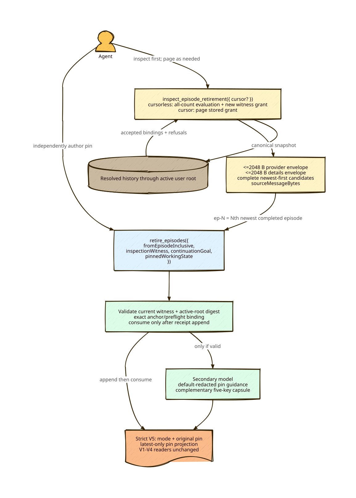

# Anchored Episode Retirement — Usability & Architecture RFC

## Status
**Automated implementation verified (C3); live user verification pending.**

Anchored retirement preserves the engine’s newest-suffix selection. `fromEpisodeInclusive` identifies the oldest included completed episode; active work is never selected.

## Diagram


## Contract

### Inspect first
`inspect_episode_retirement({ cursor? })` is read-only. A cursorless call evaluates every completed count and replaces the one in-memory inspection grant. Its response has an opaque `inspectionWitness`, newest-first bounded `candidates`, `activeEpisode`, aggregate counts/refusal reasons, and nullable `nextCursor`. Cursor calls page that exact grant; they neither re-evaluate history nor create a witness.

Candidate IDs are witness-scoped completed-episode ordinals: `ep-1` is newest completed episode; `ep-2` is the next oldest and retirement from it selects `ep-2` plus `ep-1`. Unsafe candidates are omitted without renumbering, so IDs can skip. Each page dynamically packs complete records after separately measuring complete provider-content and details JSON; both envelopes are <=2048 UTF-8 bytes. Every accepted candidate is reachable by pagination. `sourceMessageBytes` is UTF-8 byte length of non-pretty `JSON.stringify(selectedProviderMessages)`—not bytes freed.

### Retire
```json
retire_episodes({
  "fromEpisodeInclusive": "ep-2",
  "inspectionWitness": "opaque witness",
  "continuationGoal": "Write focused token-validation tests",
  "pinnedWorkingState": "Verified fixture shape; preserve no-network rule; next run the focused test."
})
```

`/retire` always inspects and pages as needed, independently authors the pin, then selects an anchor. Execution requires current in-memory witness, matching active-root snapshot digest, exact stored anchor binding, matching shared preflight, valid goal, and valid pin before secondary-model egress. The digest includes canonical resolved producer/message fingerprints through active user root and excludes later active-only traffic. Reload, cursorless inspect, new user root, or prefix/branch changes through root invalidate. Failed work before append leaves a fresh grant retryable; successful append consumes it.

### Pin and receipts
`pinnedWorkingState` remains <=2000 characters and non-empty after trim. The original formatting is stored/projected unchanged in one dedicated provider-facing block. The secondary model gets only a delimited default-redacted guidance copy and returns complementary five-key state.

Every new receipt is strict V5 with `mode: initial|forward|recompose|deepen`, original pin, and mode-specific exact provenance/composition keys. V1–V4 validators remain unchanged. V5 may parent V1–V5. Projection uses only the latest valid receipt’s own pin and capsule; earlier pins remain raw append-only provenance and recall remains cumulative.

## Verification scope
Tests must cover direction, omitted unsafe IDs, complete-envelope pagination, witness freshness/invalidation/retry, active traffic, canonical byte metric, V5 modes, mixed legacy chains, latest-only pin, recall, and zero append/egress failures.
